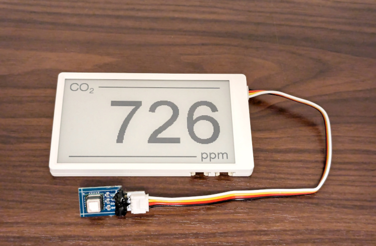

# Overview

m5paper_scd41 is a sketch for M5Paper, which is a CO2 concentration meter using [Sensirion SCD41 CO2 sensor](https://sensirion.com/products/catalog/SCD41) .

Note: [M5Paper](https://docs.m5stack.com/en/core/m5paper) is M5Stacks core device with a E-ink display.

\[日本語\]

m5paper_scd41はM5Paper用のスケッチで、[Sensirion SCD41 CO2センサー](https://sensirion.com/jp/products/product-catalog/SCD41) を使用したCO2濃度計です。

（ [M5Paper](https://docs.m5stack.com/en/core/m5paper) はM5Stacksのコアデバイスで、E-inkディスプレイを搭載しています）

# Image

# Installation

1. Connect [Sensirion SCD41 CO2 sensor](https://sensirion.com/products/catalog/SCD41) to Grove Port.A (I2C) of M5Paper.
1. Download this project from [GitHub](https://github.com/cubic9com/m5paper_scd41/) .
1. Download and install [Visual Studio Code ](https://code.visualstudio.com/) .
1. Launch VSCode.
1. Click the Extensions manager icon in the left Activity Bar.
1. Search for `platformio ide` and install the `PlatformIO IDE` extension.
1. Launch VSCode.
1. Click the PlatformIO icon in the left Activity Bar.
1. Click `QUICK ACCESS/PIO Home/Open` in the left Primary Sidebar.
1. Click `Open Project` in the `PIO HOME` tab in the right Editor Groups.
1. Open this project which you downloaded above.
1. Click the PlatformIO icon in the left Activity Bar.
1. Click `PROJECT TASKS/m5stack-fire/General/Upload` in the left Primary Sidebar.

\[日本語\]

1. [Sensirion SCD41 CO2 sensor](https://sensirion.com/products/catalog/SCD41) をM5PaperのGrove Port.A (I2C) に接続する。
1. このプロジェクトを [GitHub](https://github.com/cubic9com/m5paper_scd41) からダウンロードする。
1. [Visual Studio Code](https://code.visualstudio.com/) をダウンロードしてインストールする。
1. VSCodeを起動する。
1. 左のアクティビティバーにあるExtensions managerアイコンをクリックする。
1. `platformio ide` を検索し、 `PlatformIO IDE` エクステンションをインストールする。
1. VSCodeを起動する。
1. 左のアクティビティバーのPlatformIOアイコンをクリックする。
1. 左のプライマリサイドバーの `QUICK ACCESS/PIO Home/Open` をクリックする。
1. 右側のエディタグループの `PIO HOME` タブにある `Open Project` をクリックする。
1. 上記でダウンロードしたプロジェクトを開く。
1. 左のアクティビティバーのPlatformIOアイコンをクリックする。
1. 左のプライマリサイドバーの `PROJECT TASKS/m5stack-fire/General/Upload` をクリックする。

# Usage

1. Pressing and holding the scroll wheel of M5Paper to perform Forced recalibration (FRC).  
Note: As you know, on the M5Paper, you turn it on by pressing and holding the scroll wheel for 2 seconds. Then continue pressing it.
1. Wait 3 minutes.
1. Your M5Paper will now display the CO2 concentration every 20 minutes.  
Note: To reduce power consumption, M5Paper enters [Light-Sleep](https://docs.espressif.com/projects/esp-idf/en/stable/esp32/api-reference/system/sleep_modes.html#id1) mode except during measurement and drawing.

\[日本語\]

1. Forced recalibration (FRC) を実行するために、部屋が換気されている状態で、M5Paperのスクロールホイールを長押しする。  
（M5Paperでは、スクロールホイールを2秒間長押しすると電源がオンになるが、その後も押し続ける）
1. 3分間待つ。
1. 以降は20分毎にCO2濃度がM5Paperに表示される。  
（電力消費を抑えるため、計測・描画中以外は [Light-Sleep](https://docs.espressif.com/projects/esp-idf/en/stable/esp32/api-reference/system/sleep_modes.html#id1) モードになる）

# LICENSE

Copyright (C) 2024, cubic9com All rights reserved.

This code is licensed under the MIT license.

See file LICENSE for more information.
