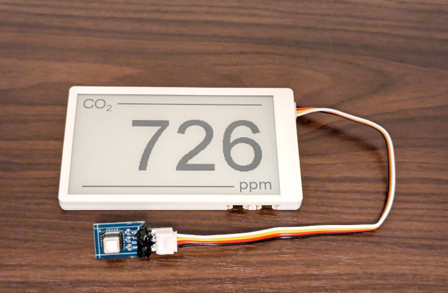

# Overview / 概要

m5paper_scd41 is a sketch for [M5Paper](https://docs.m5stack.com/en/core/m5paper), which is a low-power consumption CO2 concentration meter using [Sensirion SCD41 CO2 sensor](https://sensirion.com/products/catalog/SCD41) .

Note: M5Paper is [M5Stack](https://m5stack.com/)'s core device with a E-ink display.

\[日本語\]

m5paper_scd41は[M5Paper](https://docs.m5stack.com/en/core/m5paper)用のスケッチで、[Sensirion SCD41 CO2センサー](https://sensirion.com/jp/products/product-catalog/SCD41) を使用した低消費電力CO2濃度計です。

（ M5Paperは[M5Stack社](https://m5stack.com/)のコアデバイスで、E-inkディスプレイを搭載しています）

# Image / 写真

# Motivation / 開発のきっかけ

Due to the COVID-19 pandemic, many people in Japan, including myself, began working remotely from home more frequently.

While doing so, I started to notice an issue: poor ventilation at home often leads to a rise in indoor carbon dioxide (CO₂) levels. This, in turn, can negatively affect concentration and productivity.

In fact, various studies have shown that high indoor CO₂ levels can impair focus, decision-making, and cognitive performance—all of which are crucial for effective work.

| CO₂ concentration (ppm) | Condition/Impact |
| -------------- | -------------------- |
| 400–600 ppm    | Outdoor air level. Very good air quality. |
| 600–1000 ppm   | Typical indoor environment. Little to no problem. |
| 1000–1500 ppm  | Mild drowsiness and reduced concentration may occur. |
| 1500–2000 ppm  | Noticeable drowsiness and decreased cognitive performance. |
| Above 2000 ppm | Significant decline in decision-making and cognitive function.  |

In office buildings in Japan, ventilation is strictly regulated by laws such as the Building Standards Act (Article 28) and the Act on Maintenance of Sanitation in Buildings. These rules ensure that indoor CO₂ levels stay below 1,000 ppm.

However, such standards aren’t applied in private homes, which makes it easy to overlook ventilation and air quality during remote work.

To address this issue, I initially tried using a commercially available CO₂ monitor. While it worked well, I found it consumed more power than I expected—mostly because its screen was always on and updated data every second.

So, I decided to build my own low-power CO₂ monitor using electronic paper (e-paper). E-paper displays consume power only when the screen content is updated, making them very energy-efficient.

To further reduce power consumption, I chose a microcontroller that supports sleep mode and set the system to operate intermittently—waking up every few minutes to take readings and update the display.

For this project, I used the [M5Paper](https://docs.m5stack.com/ja/core/m5paper), a device from [M5Stack](https://m5stack.com/). It features an e-paper display and an ESP32-based wireless module.

By connecting the M5Paper with a [Sensirion SCD41 CO₂ sensor](https://sensirion.com/products/catalog/SCD41), I was able to build efficient CO₂ monitor tailored for home use.

\[日本語\]

コロナ禍をきっかけに、自宅でリモートワークをする機会が増えました。

その中で気になったのが、換気が不十分になることによるCO₂濃度の上昇と、それが原因で集中力や生産性が下がることです。

実際、室内のCO₂濃度が高くなると、集中力・判断力・意思決定力が低下し、生産性にも悪影響が出ることが、さまざまな研究で明らかになっています。

以下は、CO₂濃度とその影響の目安です。

| CO₂濃度 (ppm)     | 状態・影響                |
| --------------- | -------------------- |
| 400–600 ppm     | 屋外レベル。非常に良好な空気環境。    |
| 600–1000 ppm   | 一般的な室内環境。問題はほぼない。    |
| 1000–1500 ppm | 軽度の眠気・集中力低下が見られることも。 |
| 1500–2000 ppm | 明確な眠気、思考力低下。生産性が下がる。 |
| 2000 ppm 以上    | 判断力・意思決定能力が明確に低下する。  |

オフィスでは、[建築基準法第28条](https://laws.e-gov.go.jp/law/325AC0000000201/20251201_507AC0000000035#Mp-Ch_2-At_28) や [ビル管理法（「建築物における衛生的環境の確保に関する法律」）](https://www.mhlw.go.jp/bunya/kenkou/seikatsu-eisei10/) に基づいて換気がおこなわれており、CO₂濃度も1000ppm以下に保たれています。

しかし自宅では、そうした管理がないため、気づかないうちに空気が悪くなりやすいのです。

その対策として、市販のCO₂濃度計を使ってみたのですが、常に画面が点灯していて毎秒データが更新されるため、今度は消費電力が気になってしまいました。

そこで、電子ペーパーを使ったCO₂濃度計を自作することにしました。

電子ペーパーは表示を書き換えるときだけ電力を使うため、消費電力を抑えることができます。
さらに、電子ペーパーやCO₂センサーを制御するマイコンもスリープモード対応のものを選ぶこととしました。数分ごとに動作するように設定して、さらに消費電力を抑えます。

自作に使ったのは、[M5Stack](https://m5stack.com/) 社の [M5Paper](https://docs.m5stack.com/ja/core/m5paper) というデバイスです。これは、電子ペーパーとESP32という無線通信機能付きマイコンを搭載しています。

これに、[Sensirion社のCO2センサーSCD41](https://sensirion.com/products/catalog/SCD41) を接続することで希望通りのCO₂濃度計を作ることができました。

# Installation / インストール

1. Connect [Sensirion SCD41 CO2 sensor](https://sensirion.com/products/catalog/SCD41) to Grove Port.A (I2C) of M5Paper.
1. Download this project from [GitHub](https://github.com/cubic9com/m5paper_scd41/) .
1. Download and install [Visual Studio Code ](https://code.visualstudio.com/) .
1. Launch VSCode.
1. Click the Extensions manager icon in the left Activity Bar.
1. Search for `platformio ide` and install the `PlatformIO IDE` extension.
1. Launch VSCode.
1. Click the PlatformIO icon in the left Activity Bar.
1. Click `QUICK ACCESS/PIO Home/Open` in the left Primary Sidebar.
1. Click `Open Project` in the `PIO HOME` tab in the right Editor Groups.
1. Open this project which you downloaded above.
1. Click the PlatformIO icon in the left Activity Bar.
1. Click `PROJECT TASKS/m5stack-fire/General/Upload` in the left Primary Sidebar.

\[日本語\]

1. [Sensirion SCD41 CO2 sensor](https://sensirion.com/products/catalog/SCD41) をM5PaperのGrove Port.A (I2C) に接続する。
1. このプロジェクトを [GitHub](https://github.com/cubic9com/m5paper_scd41) からダウンロードする。
1. [Visual Studio Code](https://code.visualstudio.com/) をダウンロードしてインストールする。
1. VSCodeを起動する。
1. 左のアクティビティバーにあるExtensions managerアイコンをクリックする。
1. `platformio ide` を検索し、 `PlatformIO IDE` エクステンションをインストールする。
1. VSCodeを起動する。
1. 左のアクティビティバーのPlatformIOアイコンをクリックする。
1. 左のプライマリサイドバーの `QUICK ACCESS/PIO Home/Open` をクリックする。
1. 右側のエディタグループの `PIO HOME` タブにある `Open Project` をクリックする。
1. 上記でダウンロードしたプロジェクトを開く。
1. 左のアクティビティバーのPlatformIOアイコンをクリックする。
1. 左のプライマリサイドバーの `PROJECT TASKS/m5stack-fire/General/Upload` をクリックする。

# Usage / 使用方法

1. Pressing and holding the scroll wheel of M5Paper to perform Forced recalibration (FRC).  
Note: As you know, on the M5Paper, you turn it on by pressing and holding the scroll wheel for 2 seconds. Then continue pressing it.
1. Wait 3 minutes.
1. Your M5Paper will now display the CO2 concentration every 20 minutes.  
Note: To reduce power consumption, M5Paper enters [Light-Sleep](https://docs.espressif.com/projects/esp-idf/en/stable/esp32/api-reference/system/sleep_modes.html#id1) mode except during measurement and drawing.

\[日本語\]

1. Forced recalibration (FRC) を実行するために、部屋が換気されている状態で、M5Paperのスクロールホイールを長押しする。  
（M5Paperでは、スクロールホイールを2秒間長押しすると電源がオンになるが、その後も押し続ける）
1. 3分間待つ。
1. 以降は20分毎にCO2濃度がM5Paperに表示される。  
（電力消費を抑えるため、計測・描画中以外は [Light-Sleep](https://docs.espressif.com/projects/esp-idf/en/stable/esp32/api-reference/system/sleep_modes.html#id1) モードになる）

# LICENSE / ライセンス

Copyright (C) 2024, cubic9com All rights reserved.

This code is licensed under the MIT license.

See file LICENSE for more information.
